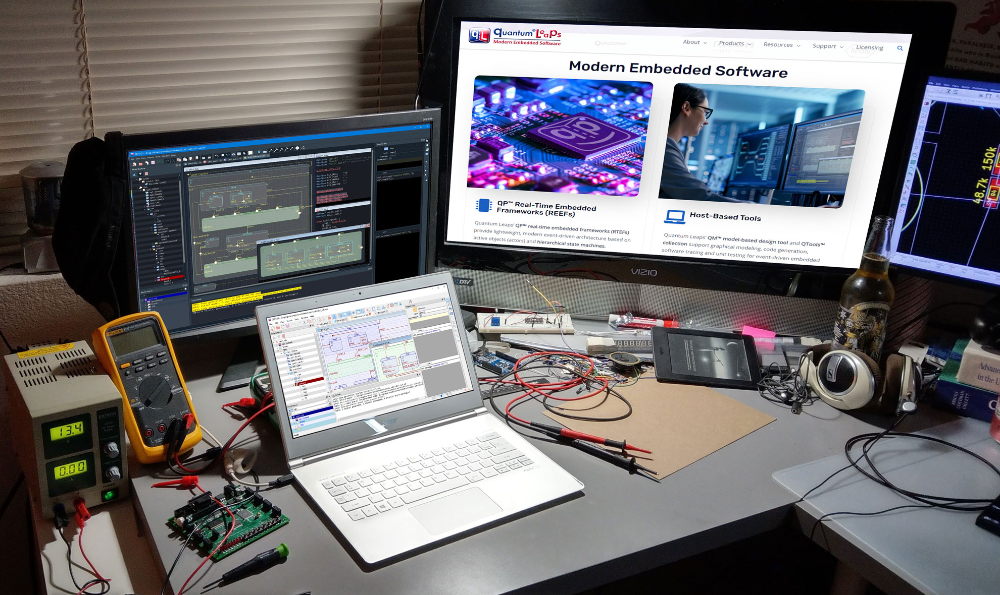
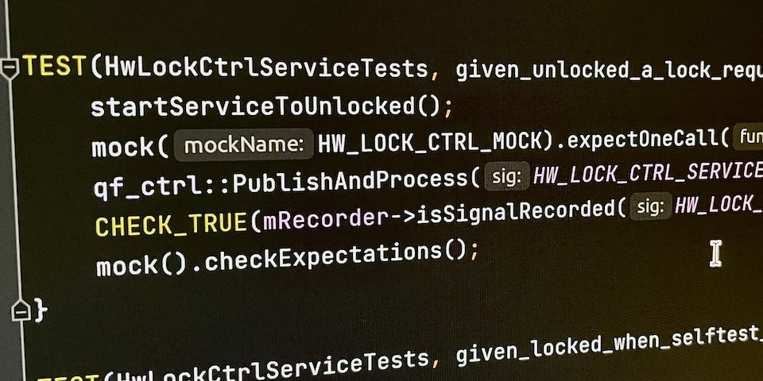
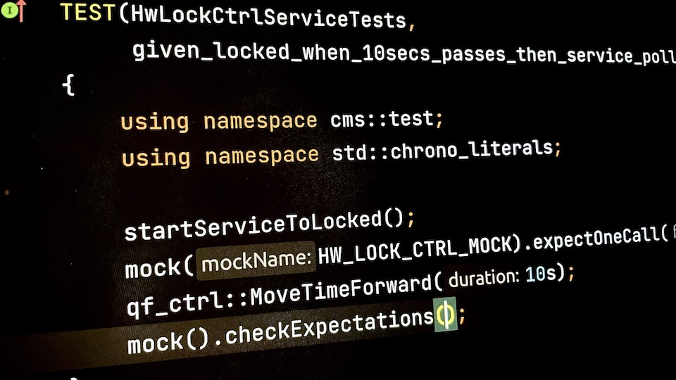
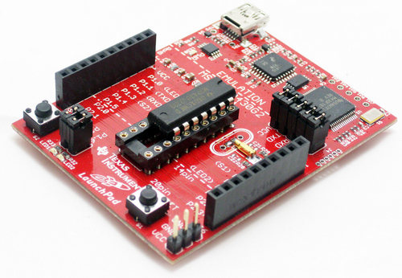
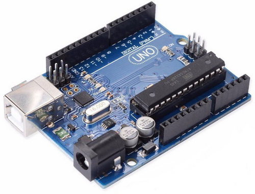

# Community Contributed Software

This repository contains links and brief descriptions of contributed software.

## QP/C++ ESP32

C++ Port for the ESP32 microcontroller from [espressif](https://www.espressif.com/). The port is compatible with the native sdk from espressif, [esp-idf](https://github.com/espressif/esp-idf), and the [arduino sdk](https://github.com/espressif/arduino-esp32). 

- Link: https://github.com/vChavezB/qpcpp/tree/esp32
- License: GPLv3

## CppUTest for QP/C++ (cpputest-for-qpcpp)

A port of `qpcpp` with additional supporting code to enable and simplify host based unit testing 
of `QActive` objects using CppUTest. Includes examples demonstrating topics such as:  
* Capturing and testing of published events.
* Testing subscribed event behavior.
* Testing direct post behavior.
* Testing interactions with other active objects.
* Testing interactions with a mocked driver.
* An example continuous integration (CI) setup using GitHub Actions.
* And more!

Additional Information:
- License: Default GPLv3, with a commercial license available upon registration.
- Link: https://github.com/covemountainsoftware/cpputest-for-qpcpp

## CppUTest for QP/C (cpputest-for-qpc)

This port is conceptually the same as `cpputest-for-qpcpp` (noted above) but instead uses QP's C language 
based framework (`qpc`) with CppUTest. See the details on `cpputest-for-qpcpp` above for benefits, which also apply to 
this version.

Additional Information:
- License: Default GPLv3, with a commercial license available upon registration.
- Link: https://github.com/covemountainsoftware/cpputest-for-qpc

## QP/C examples running on low end microcontrollers

1- A QP/C based solution for the Dining Philosopher Problem ported on MSP430G2553 with only 16 KB of flash and 512 bytes of RAM.

- Link: https://github.com/ef15c/qpc-msp430.git
- License: GPLv3

2- A QP/C port on Arduino/AVR and an example showing a solution for the Dining Philosopher Problem.

- Link: https://github.com/ef15c/qpc_avr.git
- License: GPLv3

# Licensing

The contributed software is owned by the respective developers and is *not* licensed by Quantum Leaps. Please see the linked repositories for the licensing terms offered.

